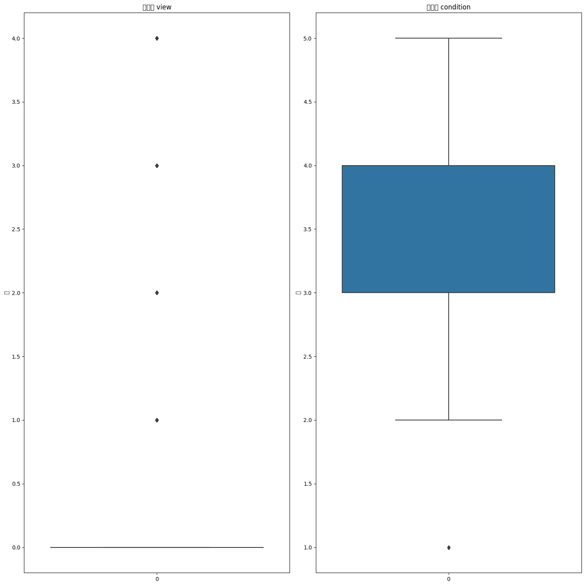

# regression-house-price

## 做法說明

### 1.資料前處理

#### A.列出所有特徵值、找出每個特徵值有哪些類別，以及有沒有NAN值和缺失值
```python
columns = train.columns.tolist
print(columns)
```
```python
def feature_unfo(feature):
    print('有哪些類別' , feature.unique())
    print('有幾個NAN值:' , feature.isna().sum())
    print('是否存在缺失值' , feature.isnull().any())
```
#### B.將原始資料的"id"columns刪除
```python
train1 =train.drop(['id'],axis="columns")
valid1 =valid.drop(['id'],axis="columns")
test1 =test.drop(['id'],axis="columns")
```

### C.離群值處理
處理"grade", "condition" , "floors" , "yr_renovated" , "waterfront" , "view"的離群值，將大於上四分位數的離群值替換成上四分位數；小於下四分位數的離群值替換成下四分位數

```python
def boxplot(feature1):
    if feature1.name not in ["grade", "condition" , "floors" , "yr_renovated" , "waterfront" , "view"]:
        print(feature1)
        print( '下四分位數Q1=' , feature1.quantile(0.25))
        print('中位數Q2=' ,feature1.quantile(0.5) )
        print('上四分位數Q3=' ,feature1.quantile(0.75) )
        print('IQR=' ,feature1.quantile(0.75)-feature1.quantile(0.25) )
        #upper boundary / lower boundary
        upper_boundary = feature1.quantile(0.75) + 1.5*(feature1.quantile(0.75)-feature1.quantile(0.25))
        lower_boundary = feature1.quantile(0.25) - 1.5*(feature1.quantile(0.75)-feature1.quantile(0.25))
        #離群值替換成upper boundary / lower boundary
        feature1 [feature1 < lower_boundary] = lower_boundary
        feature1 [feature1 > upper_boundary] = upper_boundary

selected_features = train1.drop(["grade", "condition" , "floors" , "yr_renovated" , "waterfront" , "view"], axis=1)
selected_features.apply(boxplot, axis = 0)
train1[selected_features.columns] = selected_features #替換掉原本的"grade", "condition" , "floors" , "yr_renovated" , "waterfront" , "view"
```
### D.繪製每個特徵的箱型圖

##程式方塊圖與寫法
##畫圖做結果分析
##討論預測值誤差很大的，是怎麼回事？
##如何改進？





